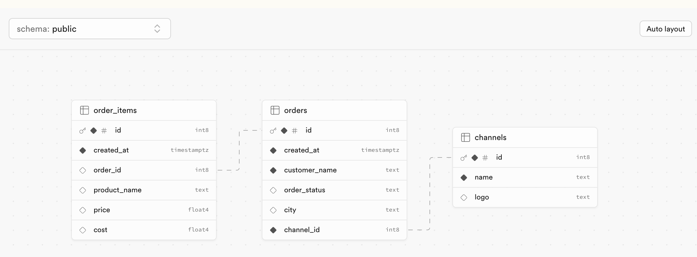

# Coding Interview Challenge

This is a mono repo that contains a boilerplate setup for both Node.js (backend) and React (frontend).

## Getting Started

To set up the project and run it locally, follow the steps below:

1. **Install dependencies**:
   ```bash
   npm install
Start the frontend (will run on port 3000):

bash
Copy code
npm run start:frontend
Start the backend (will run on port 8000):

bash
Copy code
npm run start:backend

Challenge
Below is the database schema you will be working with:



The database has three tables: orders, order_items, and channels.

orders: Contains the details of an order, including the channel_id, which indicates the source of the order (e.g., Amazon, eBay, etc.).
order_items: Contains information about the individual items in an order.
channels: Stores the details of each sales channel.
Task
Your challenge is to create an API endpoint that fetches all the orders along with their associated items and channel details. The endpoint should return this information, which will be displayed in a MUI table on the frontend.

Requirements:
Display the fetched orders in a MUI table.
The last column in the table should contain a button:
The button should be blue if the order status is UNASSIGNED.
When clicked, the button should change the order status to SHIPPED, and its color should change to yellow.
Good luck!
Feel free to adjust any parts if needed!